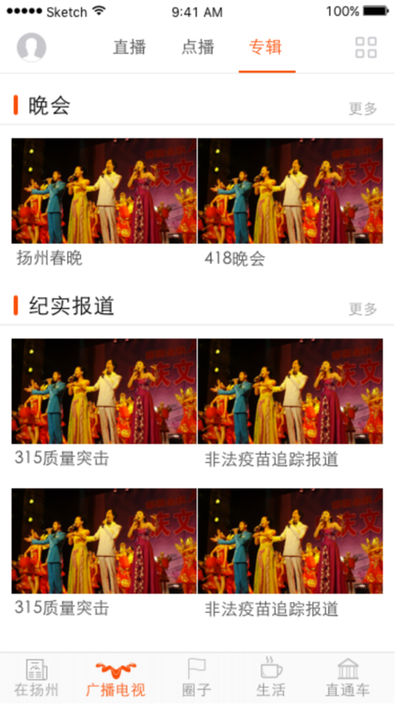
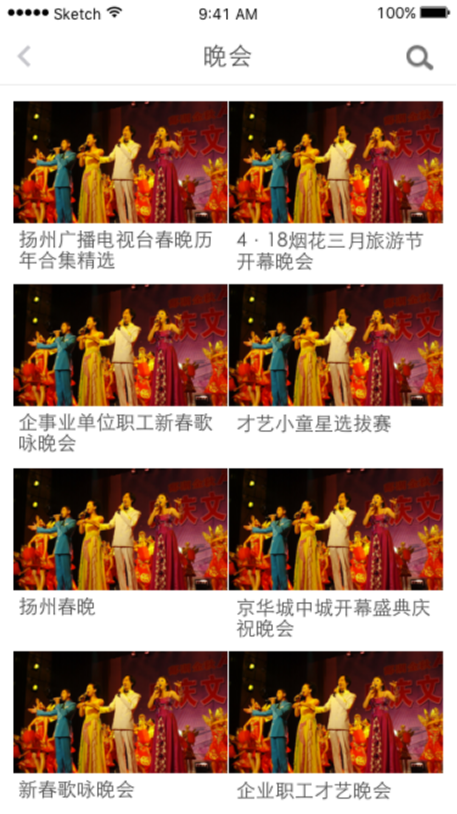

# YangFanH5，我们做的是一个webView。

## 项目目录结构
项目有下面的结构目录：
* **tools**: 这个是requirejs优化工具, **r.js**, 里面还包含优化工具的配置文件**build.js.**
* **www**: 当在开发模式中，写的代码。
* **www-built**: 用**r.js**下的配置文件构造之后，生成的文件. 包含构建的代码，可以直接部署到上线站点。

在 **www** 中有下面的结构目录：
* **index.html**: 页面APP页面中的首页，包含电视、电台所有的的直播列表。
* **channel.html**: 页面的主要功能是电视的直播、电台的收听，可以回看和回播。在页面的左边可以切换一周内的所有回看。可以写批评，在APP中
可以分享些页面，分享之后在微信和web浏览器中都可以实时播放。
* **channel.html**: 点播详情页面，用来播放需要观看的点播节目。
* **program-list.html**: 点播视频列表页面，展示每个节目频道点播的列表数据。
* **special.html**: 专辑详情页面，主要描述专辑的简介和专辑可以播放的视频内容。

| Revision #        | Author  | Reviewed | Description Of Change Summary of Review | Issued by / Issue Date |
| ----------------- |:-------:|:--------:|:----------------------------------------|:-----------------------|
| 1.0 | &ensp; | &ensp; | 初始 | 2016-02-29 |
| 2.0 | &ensp; | &ensp; | 根据3月2日扬州沟通修改设计图 | 2016-03-04 |
| 3.0 | &ensp; | &ensp; | 根据v2的反馈进行修改 1. 修改直播节目单的日期排布 2. 调整直播列表为平铺，不采用tab 3. 增加点播的次数. 4. 修改首页等多余文字 | 2016-03-07 |
| 3.1 | &ensp; | &ensp; | 电视直播频道中，会动态开通临时的现场直播， 需要后台可配置，前端直播频道的显示顺序可以在后台进行设置 | 2016-03-07 |
| 3.2 | &ensp; | &ensp; | 增加图标，替换主色调为橘红； 明确底部导航栏的关系 | 2016-03-24 |

## 1.需求概述
扬帆项目是扬州广电2016年提出的综合性移动客户端，其中包括了广播电视区域，有直播、点播、专辑。项目一期从APP端上线时间为3月25日.

## 2.产品说明
产品定位是提供频道直播、影视点播和专辑展示，预留广告、增值接口。直播频道是扬州广电提供的电视频道与广播内容，点播大部分来自于直播的拆条收录。 

## 3.产品形态
以手机app的形态展现。一期基于Android和ios平台开发。

###  Android App：
* Android手机操作系统，操作系统版本为2.3以上;
* 手机分辨率满足自适应

### IOS App:
* 适用机型:与 iPhone5以后各版本.

## 4.主要功能
* 频道直播
* 视频点播
* 专辑展示
* 实况分享

## 5.产品模块
* 直播
    * 基于扬州广电提供的直播信号 
* 点播
    * 基于直播的录制节目及分享拆条后的节目内容 
* 专辑
    * 对于直播拆条、后台录入的节目打包为专辑，有图片与说明

## 6.用户场景

### 6.1页面跳转

前置条件：用户已经登录扬帆APP；扬帆APP提供登录页面地址

行为：用户点击视听模块，APP通过页面参数传递用户ID、token与时间戳，视听模块从而确定用户的合法性。对于游客，传递的参数为空。

结果：
1. 对于校验通过的用户，显示视听的首页.
2. 对于校验不通过的用户，仅观看的时候不要求登陆；需要评论等互动时，跳转到扬帆APP提供的登录页面。

### 6.2视频欣赏与分享

前置条件：用户进入视听首页 

行为： 
1. 用户通过直播频道、点播、自媒体页面欣赏视频。
2. 用户对于自己感兴趣的片段进行亦纷享。

结果：
1. 用户获取到自己想要的视频内容
2. 用户分享指定长度的视频内容到自己的朋友圈

## 7.产品总体UI flow说明

### 7.1UI设计流程

![UI设计流程][ui]

### 7.2页面分布

扬帆提供广播电视入口，在列表页（直播频道列表、点播列表与专辑列表）上部保持用户头像、分类等，下部提供主栏目切换页面。  
扬帆app在切换到广播电视页面时，需要提供用户名称、用户token等信息供页面完成后续鉴权，如6.1所示。  
经与扬州广电秦磊主任等3月2日的沟通，整体产品页面采用黑白灰色调为主，button采用蓝色为主。(目前主app色调为橘红色)  

#### 7.2.1 直播列表页

包括电视直播、广播直播。考虑到频道数量，采用直接呈现的方式。电视与电台同时向上滚动
![直播列表页][live]

#### 7.2.2 直播详情页

![直播详情页][liveDetails]
![直播详情页][liveDetails2]
![直播详情页][liveDetails3]
![直播详情页][liveDetails4]

#### 7.2.3 点播列表页

以栏目为维度进行划分，每个栏目包括不定数量的编排好的节目集合。点击节目集合按钮后进入节目列表页。

#### 7.2.4 点播详情页

#### 7.2.5 专辑列表页

专辑也以栏目的方式呈现。  
专辑包括16：9的海报图，专辑名称，简介，包括若干个事先编排好的视频，视频详情等与点播相同。

#### 7.2.6 亦纷享页面

从点播与直播详情页都可以点击亦纷享按钮  ，进入亦纷享页面

[ui]:                        public/images/markdown/1.png "UI设计流程"
[live]:                      public/images/markdown/2.png "图一 频道&电台"
[liveDetails]:               public/images/markdown/3.png "图二 频道直播详情页"
[liveDetails2]:              public/images/markdown/4.png "图二 频道直播详情页"
[liveDetails3]:              public/images/markdown/5.png "图二 频道直播详情页"
[liveDetails4]:              public/images/markdown/6.png "图 广播评论页"